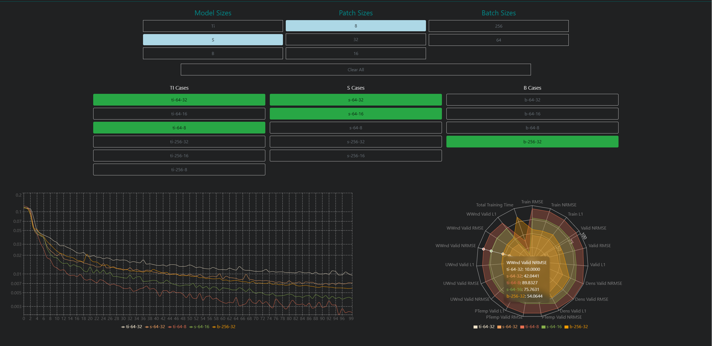
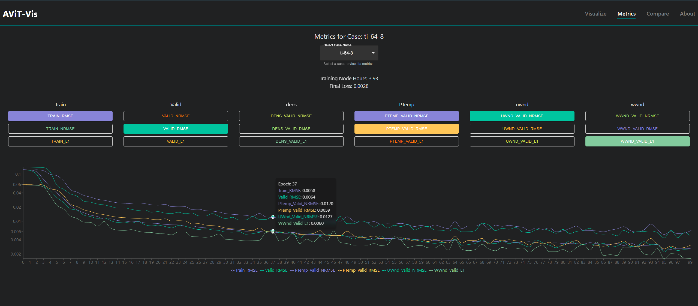
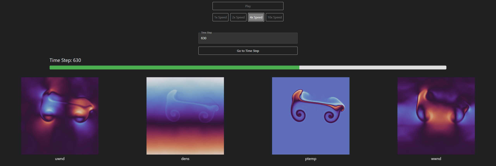

# Net-Vis

**Net-Vis** is a web application designed to provide interactive visualizations of performance metrics for machine learning models in physics simulations. This project was built using React, TypeScript, and Python.

## Features

- **Interactive Visualizations**: View and analyze performance metrics with dynamic charts and graphs.
- **Data Processing CLI**: Process and normalize data with a command-line interface.
- **NetCDF File Support**: Visualize fluid dynamics training data using matplotlib frame animations.
- **Flask API Integration**: Optional Flask server for managing and processing training metrics.

## Screenshots





## Installation

### Prerequisites

- **Node.js** (v14 or later) for the client application.
- **Python** (v3.8 or later) for the server and data processing scripts.

### Setup

1. **Clone the Repository**

   ```sh
   git clone https://github.com/josephjquinn/net-vis.git
   ```

2. **Install Client Dependencies**

   Navigate to the `client` directory and install the required Node.js packages:

   ```sh
   cd net-vis/client
   npm install
   ```

3. **Install Server Dependencies**

   Navigate to the `server` directory and install the necessary Python packages:

   ```sh
   cd ../server
   pip install -r requirements.txt
   ```

4. **Run the Client Application**

   Start the client application:

   ```sh
   npm run dev
   ```

5. **Run the Data Processing Scripts**

   Process your data using the CLI:

   ```sh
   python main.py [flags]
   ```

6. **Start the Optional Flask Server**

   If you wish to use the Flask server for API management:

   ```sh
   python run.sh
   ```

## CLI Flags

The Data Processing Command Line Interface (CLI) provides several options for managing your data:

- `--data_dir`: Path to the directory containing data files (default: `./metrics/`).
- `--case_name`: Specify a case to process; if omitted, all cases will be processed.
- `--all`: Process all cases in the directory.
- `--norm`: Normalize metrics for all cases.
- `--min`: Compute minimum values for all metrics across cases.

## API Endpoints

If using the optional Flask server, the following API endpoints are available:

- `GET /metrics/<case>/`: Retrieve and process metrics for a specific case.
- `GET /all/<case>/`: Aggregate metrics from all cases in the directory.
- `GET /all`: Normalize metrics to a scale of 0-100 for radar charts.
- `GET /norm`: Extract minimum values for metrics across all cases.
